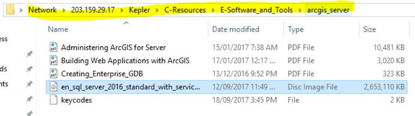
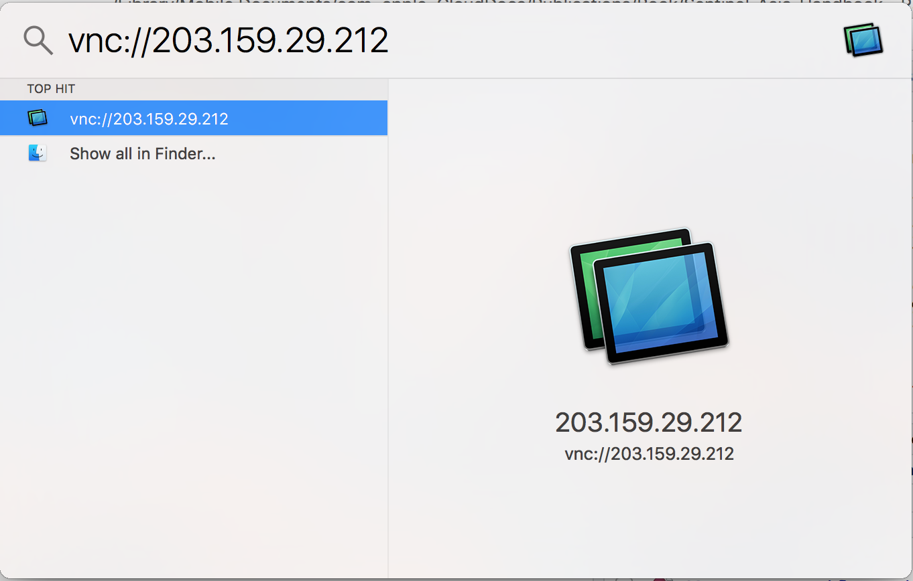

# PC/Servers Management

For Sentinel Asia and IDC Activation, we use several PC and servers for processing, storing data and results. 


## ArcGIS Enterprise Geodatabase Connection


### Downloading SQL Server and setting it up 

Note: This needs to be completed only once before you can connect to the server. 

1.	Download and install SQL sever 
2.	This is found in KEPLA: 
\\203.159.29.17\Kepler\C-Resources\E-Software_and_Tools\arcgis_server 
 
```{r fig411a,echo=FALSE, message=FALSE, warning=FALSE, out.width='70%', fig.asp=.75, fig.align='center'}

```

```{r fig411b, echo=FALSE, message=FALSE, warning=FALSE, out.width='70%', fig.asp=.75, fig.align='center'}
knitr::include_graphics("img/fig43_arcgis2.png")
```

3. Go through general installation prompts to install. 


```{r fig411c, echo=FALSE, message=FALSE, warning=FALSE, out.width='70%', fig.asp=.75, fig.align='center'}

```


4.	Click next and agree to go through the installation steps. 
5.	Features selection -select the boxes shown below 


```{r fig411d, echo=FALSE, message=FALSE, warning=FALSE, out.width='70%', fig.asp=.75, fig.align='center'}
knitr::include_graphics("img/fig43_arcgis4.png")
```

6. Complete the rest of the steps and instal the server. 

### Connecting to Geodatabases 

Connecting to the server and the databases is important as it allows the user to find and locate common data.

You can connect through either ArcCatalog or ArcGIS Pro Contents. 
Connecting through ArcCatalog: 

1.	Open ArcCatalog 

2.	Add Database connection as follows:
 

```{r fig411e, echo=FALSE, message=FALSE, warning=FALSE, out.width='70%', fig.asp=.75, fig.align='center'}
knitr::include_graphics("img/fig43_arcgis5.png")
```
 
3.	Connect to the Database using the following fields: 


```{r fig411f, fig.cap='Username: gic, password: GICuser123', echo=FALSE, message=FALSE, warning=FALSE, out.width='70%', fig.asp=.75, fig.align='center'}
knitr::include_graphics("img/fig43_arcgis6.png")
```
 

4.	On the Database drop down list, here is where you select which database to connect to. 
Perform this step multiple times to connect to all relevant databases you want to access - once connected you won’t need to connect again. 

Databases: 

- CDB - This is the common database with all common country data (vector) 

- CDB_R - This it the common database with all raster data 

- ArcGIS online - This is for ArcGIS Online files 

- SA - Sentinel Asia 

- SA_R - Sentinel Asia Raster 


```{r fig411g, echo=FALSE, message=FALSE, warning=FALSE, out.width='70%', fig.asp=.75, fig.align='center'}

```
 


5.	Once the chosen Database is connected it will show on the side bar, y ou can rename this to the database name - double click this to open and view the data. All data in the database will show up here, with the database name followed by the file name. 


6.	For the common database, all countries are clustered into raster datasets, click these to open. 

```{r fig411h, echo=FALSE, message=FALSE, warning=FALSE, out.width='40%', fig.asp=.75, fig.align='center'}

```

```{r fig411i, echo=FALSE, message=FALSE, warning=FALSE, out.width='40%', fig.asp=.75, fig.align='center'}
knitr::include_graphics("img/fig43_arcgis8b.png")
```
 
  

Note: Click description to find the corresponding names for country codes 
 


```{r fig411j, echo=FALSE, message=FALSE, warning=FALSE, out.width='70%', fig.asp=.75, fig.align='center'}
knitr::include_graphics("img/fig43_arcgis9.png")
```
 

7.	If you want to use this data in your map file, just drag the data into ArcMap from ArcCatalog, it will open like any file 


```{r fig411k, echo=FALSE, message=FALSE, warning=FALSE, out.width='70%', fig.asp=.75, fig.align='center'}

```
 

8.	You can also access the database from ArcCatalog in the side bar of ArcMap: 


```{r fig411l, echo=FALSE, message=FALSE, warning=FALSE, out.width='70%', fig.asp=.75, fig.align='center'}
knitr::include_graphics("img/fig43_arcgis11.png")
```
 
Following link in Youtube will provide you on the how to do the procedure https://youtu.be/3DWrBp_5MJc


## SQL Server

GIC Enterprise Databases are stored in SQL Server. The databases are regularly backup to Kepler and Google Drive (geoinfo )

### Maintenance

#### SQL Backup and Monitoring

https://youtu.be/OBk0SdeB3IM

#### SQL Database Recovery

We have to make one session to practice on how to recover database, in case of hard drive failure.

## IMS-Server
### Connection


## Sentinel-PC
### Connection

https://www.youtube.com/watch?v=Dpx9NslsIqg&feature=youtu.be


<!-- ### Softwares -->

<!-- #### ArcGIS -->


<!-- #### QGIS -->


## MacPro
### Connection

https://youtu.be/xje9lyKYTSw

<!-- - From Windows -->

<!-- -- VNC Viewer -->


<!-- -- Bitvise SSH Client -->

<!-- --- Download Bitvise SSH Client installer from the website __https://www.bitvise.com/ssh-client-download__ -->

<!-- ```{r fig42ia, fig.cap='Bitvise SSH Client web page',echo=FALSE, message=FALSE, warning=FALSE, out.width='70%', fig.asp=.75, fig.align='center'} -->
<!--  -->
<!-- ``` -->

<!-- --- Install Bitvise SSH Client -->

<!-- --- Configuring public key authentication with Bitvise SSH Client -->

<!-- This section of Getting Started assumes that: -->

<!-- You have recently installed Bitvise SSH Server. -->

<!-- You have configured the SSH Server for access using SFTP, for Git access, or another purpose. -->

<!-- You have installed Bitvise SSH Client on the computer from which you wish to connect. -->

<!-- You wish to configure public key authentication between the SSH Server and Client. -->

<!-- ---- Understanding public key authentication -->

<!-- Before you configure public key authentication, it is important to understand: -->

<!-- * Public keys, in the way they are commonly used in SSH, are not X.509 certificates. -->
<!-- * Client authentication keys are separate from server authentication keys (host keys). -->
<!-- * A keypair consists of a private key and a public key, which are separate. -->
<!-- * A private key should never be sent to another party. It is private. -->
<!-- * If this is the first time you are using public keys, we recommend the page Public keys in SSH. -->


<!-- ---- Generate public/private keypair -->

<!-- Windows does not have a built-in tool for generating SSH keys, so you must use a third-party tool to generate SSH keys if you are on a Windows workstation. Here, we describe how to generate SSH keys with the PuTTYgen tool. -->

<!-- Download puttygen.exe. -->

<!-- Run PuTTYgen. For this example, simply run the puttygen.exe file that you downloaded. A window opens where you can configure your key-generation settings. -->

<!-- Click Generate and follow the on-screen instructions to generate a new key. For most cases, the default parameters are fine, but you must generate keys with at least 2048 bits. When you are done generating the key, the tool displays your public key value. -->

<!-- In the Key comment section, replace the existing text with the username of the user for whom you will apply the key. -->

<!-- Optionally, you can enter a Key passphrase to protect your key. -->

<!-- Click Save private key to write your private key to a file with a .ppk extension. -->

<!-- Click Save public key to write your public key to a file for later use. Keep the PuTTYgen window open for now. -->


<!-- - From Mac -->

<!-- -- Terminal -->


<!-- -- VNC -->
<!-- -- Click Spotlight and type vnc://203.159.21.212 -->

<!-- ```{r fig41a, fig.cap='Accessing MacPro using VNC',echo=FALSE, message=FALSE, warning=FALSE, out.width='70%', fig.asp=.75, fig.align='center'} -->
<!--  -->
<!-- ``` -->

<!-- -- Type username and password -->

<!-- ```{r fig41b, fig.cap='Type username and password',echo=FALSE, message=FALSE, warning=FALSE, out.width='70%', fig.asp=.75, fig.align='center'} -->
<!--  -->
<!-- ``` -->


<!-- -- Mac environment after login -->

<!-- ```{r fig41c, fig.cap='Mac environment',echo=FALSE, message=FALSE, warning=FALSE, out.width='70%', fig.asp=.75, fig.align='center'} -->
<!-- knitr::include_graphics("img/fig41_vnc2.png") -->
<!-- ``` -->


<!-- - From Windows -->

## Cloud Server (Google Compute Engine)

In case of IDC activation, some of the data will be provided through FTP sites (port 21). FTP port is restricted at the office network, we have to download the data by using the server located in GIC Google Compute Engine. This method will also increase downloading speed from certain data provider (e.g., CNES). 

The method is explained in this video link https://youtu.be/NS6oLCNrGHg

<!-- ### Accessing the server through web browser -->

<!-- ### Starting and stopping the server -->

<!-- ### Data download -->

<!-- #### SSH Tunneling -->

<!-- If you do not have an existing private SSH key file and a matching public SSH key file that you can use, generate a new SSH key. If you want to use an existing SSH key, locate the public SSH key file. -->


<!-- ##### Creating keygen -->

<!-- ##### Connecting through SSH -->

<!-- ##### Starting VNCServer -->


<!-- ##### Connecting to VNC Server -->


<!-- ### Softwares -->