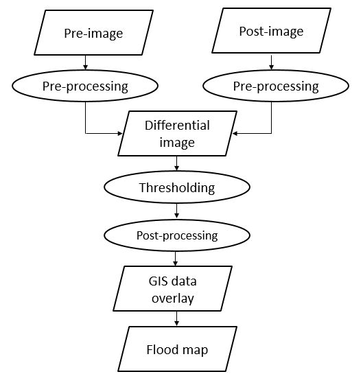
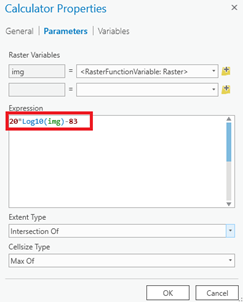
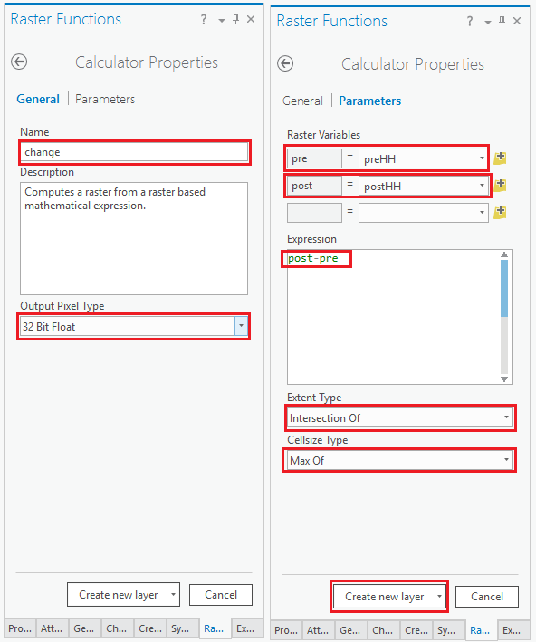
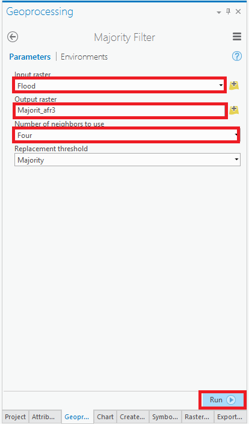
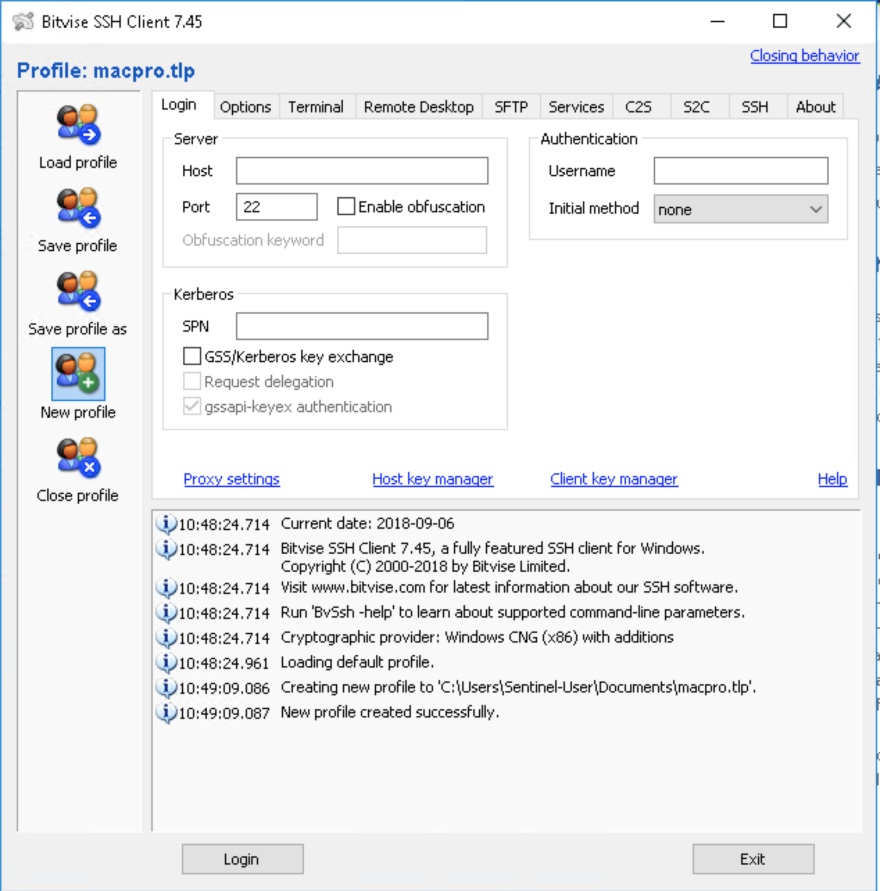
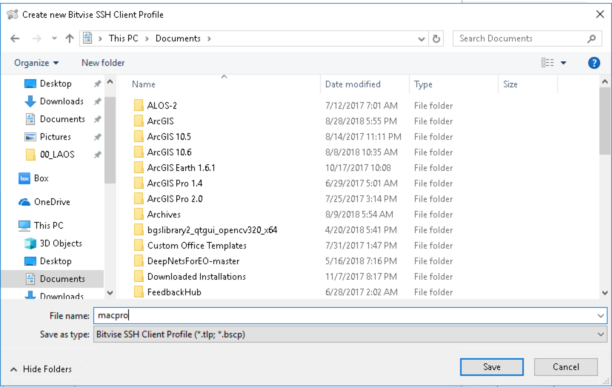
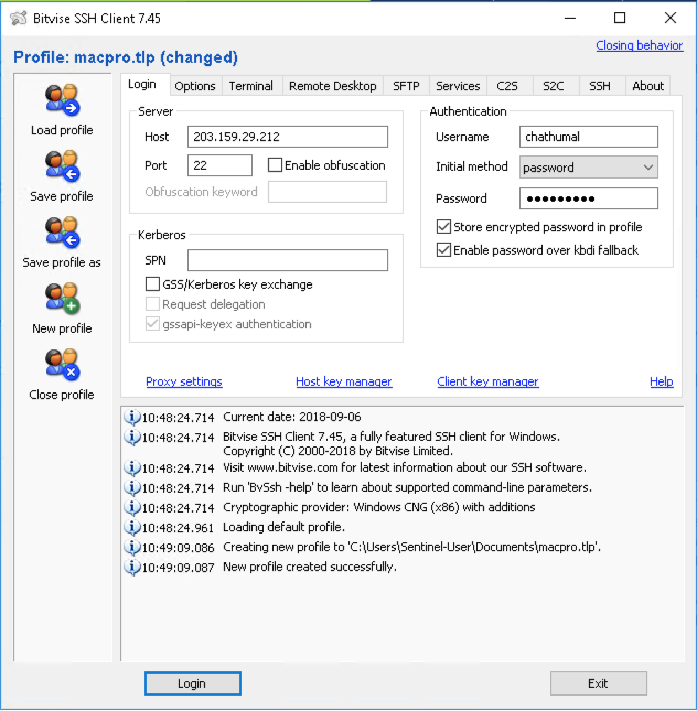
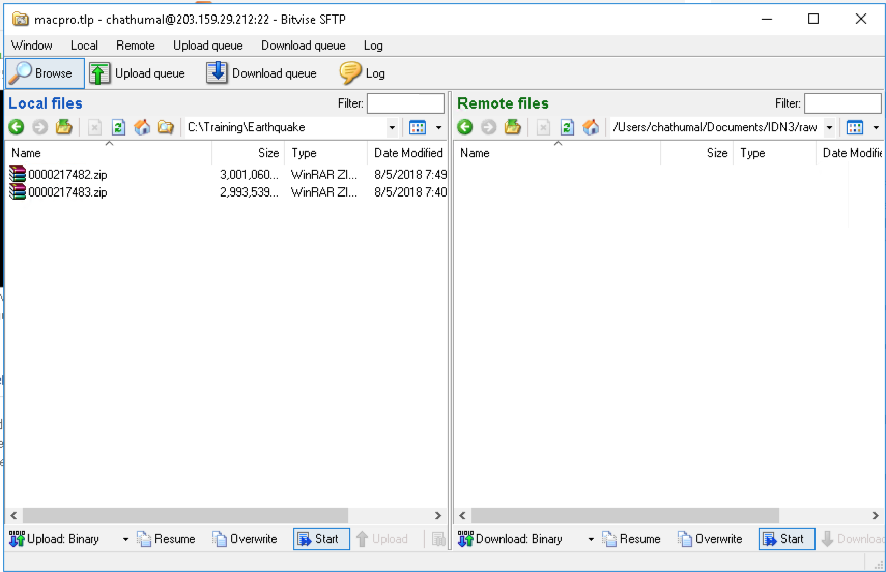
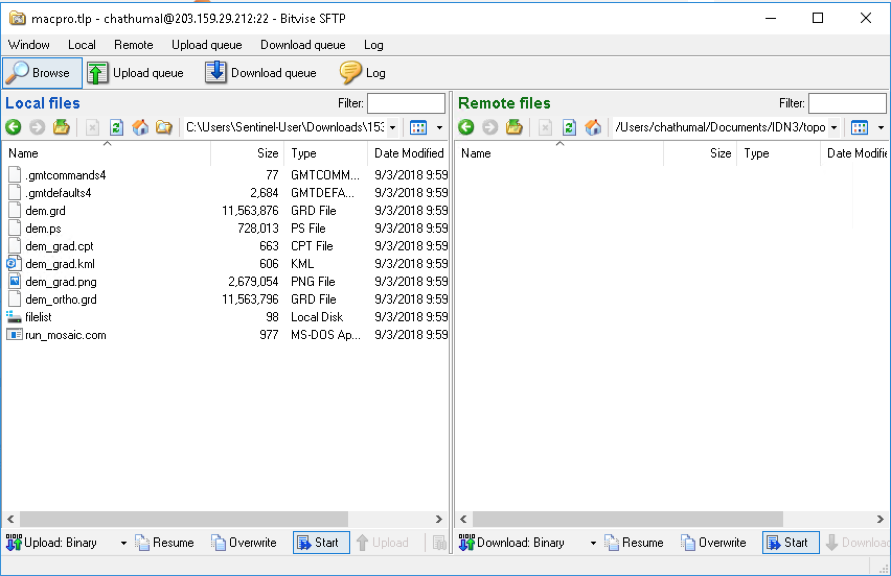

# Standard Operational Procedure (SOP)

This chapter is arranged to different sections according to the most frequent type of disaster in previous Sentinel Asia Activities. On each section, the explanation will be based on available data.

## Data Download

### Sentinel Asia Website

https://youtu.be/yZJi4FRw4Ps

### IDC Data Download via FTP

Data can be downloaded from Google Cloud Compute Engine via FTP and put in HTTP folder.

## Data processing

###Flood

#### SAR

##### ArcGIS

Before processing the data, it is better to check the processing level from the filename. 

The data (pre and post flood) was processed through 5 main steps: 
(1) Data processing including:  Radiometric calibration, Speckle filtering, and Coordinate transformation; 
(2) Image differencing using image pre and post-flood;
(3) Thresholding of backscatter changes;
(4) Image filtering using majority filter; and 
(5) Mapping of flooded area. 
The methodology is shown in the figure below.

Image for Workflow


<div class="figure" style="text-align: center">

<p class="caption">(\#fig:fig42a)Flood Detection General Workflow</p>
</div>

(Step 1: ArcGIS Pro) Radiometric calibration, Speckle filtering, and Coordinate transformation

Raster Function in ArcGIS Pro is used to process the images (pre and post-flood), with flowchart as follow:


<div class="figure" style="text-align: center">

<p class="caption">(\#fig:fig42b)ALOS-2 radiometric and geometric calibration Workflow</p>
</div>


- To convert raw image to sigma nought with the formula 20 * Log10(DN) – 83


<div class="figure" style="text-align: center">

<p class="caption">(\#fig:fig42c)ALOS-2 radiometric calibration formula</p>
</div>

- To do image filtering with Lee filter (5x5 window size).

<div class="figure" style="text-align: center">

<p class="caption">(\#fig:fig42d)ALOS-2 speckle reduction</p>
</div>

- To convert coordinate to GCS_WGS_1984

<div class="figure" style="text-align: center">

<p class="caption">(\#fig:fig42e)Reprojection to GCS WGS84</p>
</div>


(Step 2: ArcGIS Pro) Image differencing
Using the Calculator raster function to create a difference image, with the formula
Change = (Post-flood) - (Pre-flood)


<div class="figure" style="text-align: center">

<p class="caption">(\#fig:fig42f)Image differencing</p>
</div>

(Step 3: ArcGIS Pro) Thresholding of backscatter changes
Using the Calculator raster function to extract flood inundation areas from the result in step 2 with threshold < -3. 

<div class="figure" style="text-align: center">

<p class="caption">(\#fig:fig42g)Image thresholding</p>
</div>

(Step 4: ArcGIS Pro) Image filtering
Majority filter is applied to reduce noise (salt and pepper) from result in step 3. 
(Toolboxes\Spatial Analyst Tools\Generalization\Majority Filter)

<div class="figure" style="text-align: center">

<p class="caption">(\#fig:fig42h)Image filtering</p>
</div>

Then, convert raster to polygon and export to shapefile (.shp) format for a further step in ArcMap.

##### QGIS

Flood detection can be carried out in QGIS by using Graphical Modeling as shown in the following video

https://youtu.be/HR_7kENFGT4

<!-- ```{r fig42i, fig.cap='Graphical Model of flood detection',echo=FALSE, message=FALSE, warning=FALSE, out.width='70%', fig.asp=.75, fig.align='center'} -->
<!-- knitr::include_graphics("img/flood_detection_model.png") -->
<!-- ``` -->


#### Optical data

#### Google Earth Engine (GEE)

// Load Sentinel-1 images to map the flooding area, 
// This script was originally written by Simon Ilyushchenko (GEE team)
// Default location
var pt = ee.Geometry.Point(96.4633,17.79);  //, ,  Grand Morin near Coulommiers

// Load Sentinel-1 C-band SAR Ground Range collection (log scaling, VV co-polar, Descending)
var collection = ee.ImageCollection('COPERNICUS/S1_GRD').filterBounds(pt).
filter(ee.Filter.listContains('transmitterReceiverPolarisation', 'VV')).
filter(ee.Filter.eq('orbitProperties_pass', 'DESCENDING')).
select('VV'); 

// Filter by date, ensure that the result will cover only 1 day

var before = collection.filterDate('2016-05-5', '2016-05-6').mosaic();
var after = collection.filterDate('2018-07-24', '2018-07-25').mosaic();

// Threshold smoothed radar intensities to identify "flooded" areas.
var SMOOTHING_RADIUS = 100;
var DIFF_UPPER_THRESHOLD = -3;
var diff_smoothed = after.focal_median(SMOOTHING_RADIUS, 'circle', 'meters')
.subtract(before.focal_median(SMOOTHING_RADIUS, 'circle', 'meters'));
var diff_thresholded = diff_smoothed.lt(DIFF_UPPER_THRESHOLD);

//Define the extent for exporting the result
var geometry = ee.Geometry.Rectangle([105.321, 20.3574, 106.971, 21.313473]);


// Display map
Map.centerObject(pt, 10);
Map.addLayer(before, {min:-30,max:0}, 'Before flood');
Map.addLayer(after, {min:-30,max:0}, 'After flood');
Map.addLayer(after.subtract(before), {min:-10,max:10}, 'After - before', 0);
Map.addLayer(diff_smoothed, {min:-10,max:10}, 'diff smoothed', 0);
Map.addLayer(diff_thresholded.updateMask(diff_thresholded),
{palette:"0000FF"},'flooded areas - blue',1);


// Export the image, specifying scale and region.


// Pre-flood
Export.image.toDrive({
  image: before,
  description: 'MMM_image_SentinelBefore',
  scale: 30,
  region: geometry
});


// Post-flood

Export.image.toDrive({
  image: after,
  description: 'MMM_image_SentinelAfter',
  scale: 30,
  region: geometry
});


//Flood
Export.image.toDrive({
  image: diff_thresholded,
  description: 'MMM_image_SentinelFlood',
  scale: 30,
  region: geometry
});


#### Permanent Water

### Earthquake

#### GMT5SAR

1. Client software

- If you use Windows, you have to install BitVise SSH Client. 


-- The software can be downloaded from https://www.bitvise.com/ssh-client-download. BitVise SSH client provides terminal application to connect via SSH and 

-- Create New Profile.

<div class="figure" style="text-align: center">

<p class="caption">(\#fig:fig52a)Create New Profile in BitVise SSH Client</p>
</div>
 

-- Save the profile as macpro in the folder.


<div class="figure" style="text-align: center">

<p class="caption">(\#fig:fig52b)Saving the new profile</p>
</div>
 

-- Fill in the New Profile and click Save Profile.


<div class="figure" style="text-align: center">

<p class="caption">(\#fig:fig52c)Completing the profile</p>
</div>

-- Click Login 

<div class="figure" style="text-align: center">

<p class="caption">(\#fig:fig52d)BitVise xterm</p>
</div>

<div class="figure" style="text-align: center">

<p class="caption">(\#fig:fig52e)BitVise SFTP</p>
</div>


- If you use Mac or Linux, you can connect to MacPro by using Terminal. 

-- Connect to MacPro with your provided username (e.g., dan@203.159.29.212)

```
firmanhadi:~ firmanhadi$ ssh gic@203.159.29.212
Password:
```

2. Folder and file preparation

- Go to Documents folder and create new folder (e.g., IDN3)

```
IMS:~ gic$ cd Documents
IMS:Documents gic$ mkdir IDN3
```

- Go to IDN3 folder 

```
IMS:Documents gic$ cd IDN3
```

- Create new folder (raw, topo)

```
IMS:IDN3 gic$ mkdir raw && mkdir topo
```

- Copy the config file from BOOTCAMP

```
IMS:IDN3 gic$ cp /Volumes/BOOTCAMP/IDN_SAR/config.alos2.slc.txt .
```

- Confirm the structure of the folder

```
IMS:IDN3 gic$ ls -l
total 8
-rwxr-xr-x@ 1 gic  staff  3605 Sep  6 10:37 config.alos2.slc.txt
drwxr-xr-x  2 gic  staff    68 Sep  6 10:31 raw
drwxr-xr-x  2 gic  staff    68 Sep  6 10:31 topo
```

3. Download DEM from GMTSAR website

- With the browser in your computer, go to this link http://topex.ucsd.edu/gmtsar/demgen/

- Enter the coordinate for north, south, east and west. The boundary cannot span more than 4 longitude by 4 latitude degrees.

- Click Generate to process.

- If it has finished, click Download to get the result. 

- Extract the result to temporary folder in your computer

<div class="figure" style="text-align: center">

<p class="caption">(\#fig:fig44a)Downloading DEM for GMT5SAR processing</p>
</div>
 
4. Copying the ALOS-2 data and DEM

- Copy the ALOS-2 data (IMG, LED and VOL- files) to raw folder

<div class="figure" style="text-align: center">

<p class="caption">(\#fig:fig52g)Uploading ALOS-2 data to raw folder</p>
</div>

- Extract the files downloaded from DEM Generation process in GMTSAR website and copy all of the files to topo folder.


<div class="figure" style="text-align: center">

<p class="caption">(\#fig:fig52f)Uploading DEM files to topo folder</p>
</div>

5. Modifying config file

- If it is the first time in processing, set the value for proc_stage to 1 (proc_stage = 1).

- Set dummy value for SLC_factor, 4.0 (SLC_factor = 4.0). This is important as we will receive a warning message to change the value to the correct one.

- Set topo_phase to 1, to subtract topo_ra from the phase (topo_phase = 1)

- Set shift_topo to 0.
   
- Set switch_master to 1 if we assume master as repeat and slave as reference. Set it to 0, if we assume master as reference and slave image as repeat. The default value is 0 (switch_master = 0)

- For filtering, set filter_wavelength = 100, and filter1 = gauss_alos_100m.
  
- Set decimation of images to 1 if we want higher resolution image and set it to 2 if we want smaller resolution (dec_factor = 1). _For training purpose, set it to 2._

- Set correlation threshold for snapu to 0.1 (threshold_snaphu = 0.1)

- Leave the option blank to unwrap the whole region (region_cut = ). Note that, in the latest version of GMT5SAR, this option will be executed if we write the config for interpolation (near_interp = 1). If we don’t put this option for interpolation, the result will be unwrapped to half of the image.

- For masking the Lake or Ocean, set switch_land to 1 (switch_land = 1).

- Set defomax = 0 for smoother unwrapped phase.

- Set threshold_geocode = .10


7. Running the InSAR process

- Under IDN3 folder, by using Command Line, run this command “p2p_ALOS2_SLC.csh IMG-master IMG-slave config.alos2.slc.txt”. Change IMG-master with the full file name of IMG as master and IMG-slave with the full file name of slave IMG.

- Wait for the process to finish. It will take some time depend on the CPU speed and also the type of data. SM1 data will take longer than SM3.

- The results will be created in intf folder, under IND folder.

- KML files can be opened using Google Earth. Files without _ll suffix are still in azimuth and range coordinates, those with _ll suffix mean already in Geographic Coordinate System WGS84.

8. Converting to GeoTIFF

- Files with .grd extension can be opened using QGIS and then exported to GeoTIFF format.

- The results in TIFF extension are used in ArcMap for layouting.

### Volcano


### Landslide

### Glacier Lake Outburst Flood

### Oil Spill


### Forest Fire

## Data Layout

### Check and re-check
1. Check and re-check the draft of VAP before uploading to SA server.
2. Compare the geometry with other available online data
## Data Upload to Server

